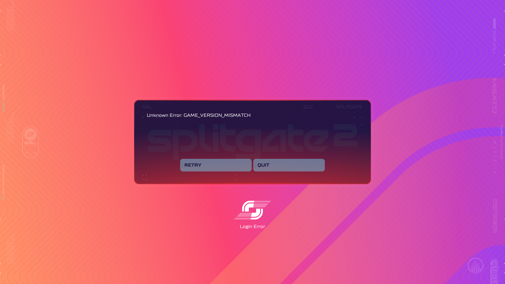

# FINDING-2026-09-01-007: June 6, 2025 build reaches game-version validation

- Status: observed
- Confidence: high
- First observed: 2026-09-01
- Build: 2025-06-06
- Manifest: `7405019827575083750`
- Depot: `2918301`
- App: `2918300`

## Observation

The June 6, 2025 Splitgate 2 build can be launched locally from its historical depot. On startup:

1. The Battle Royale introductory trailer plays successfully.
2. The client proceeds to the loading screen and plays the associated loading music.
3. The client then displays:
   `Unknown Error: GAME_VERSION_MISMATCH`
4. The available actions are `Retry` and `Quit`.

No playable lobby or match was reached during this test.

## Local content

The Battle Royale introductory trailer is present in the historical game files and plays without requiring the current live service to provide the video. This establishes that this onboarding asset was distributed with the client build rather than being fetched at launch from the current service infrastructure.

## Network correlation

A Linux/Proton launch capture from the June 6 build was analysed alongside `PortalWars2.log` and the corresponding Steam/Proton runtime log.

The client reports the following launch-time sequence:

1. `Maverick::Rooster::Api::Metadata::GetErrorCodeConfig` fails with error code `7` and message `RBAC: access denied`.
2. `UPortalWarsErrorCodeConfig::QueryConfigInternal` reports failure with `[1.1.16] unknown`.
3. `Online.Config.ErrorCodes` therefore fails to load.
4. Approximately 1.1 seconds later, `Maverick::FUserClient::Login` fails with error code `9` and reason `GAME_VERSION_MISMATCH`.
5. `FAuth1047::Login` and `FOF1047LoginRequest::MaverickLogin` propagate the same `GAME_VERSION_MISMATCH` result.

The PCAP contains 2,295 packets over approximately 44.45 seconds. It contains TLS traffic for Maverick production endpoints including `api-aga-prod.maverick-global.prod.1047games.com` and related Maverick services. The login failure is therefore temporally correlated with encrypted application traffic to the Maverick service layer.

The packet payload is TLS-encrypted, so this capture does not expose the fields contained in the login response itself.

## UI presentation

The `GAME_VERSION_MISMATCH` popup has a split visual lineage:

- The large surrounding background treatment is strongly consistent with Splitgate 2's own launch-era visual language: the bright pink/orange/purple treatment is SG2-styled.
- The popup/dialog itself uses the red and dark-blue colour scheme associated with Arena Reloaded's popup presentation, while retaining the Splitgate 2-style dialog construction and layout.

This makes the popup visually distinct from a purely SG2-era presentation: the apparent reuse is in the popup/dialog colour treatment rather than in the surrounding background.

The client is able to render the popup after `Online.Config.ErrorCodes` failed to load. This is evidence that successful retrieval of that configuration is not required for the error screen to be displayed.

No direct evidence in the capture shows a server-supplied colour, colour name, theme identifier, or brush/material selection. Because the login response is TLS-encrypted, the absence of such a field cannot be proven from this capture alone.

### Current interpretation

The strongest present interpretation is that the backend supplies the semantic `GAME_VERSION_MISMATCH` failure, while the visible popup presentation is determined by the client. The red/dark-blue dialog treatment may therefore be a locally bundled or reused UI style originating from Arena Reloaded and applied to an SG2-era error widget.

The `Online.Config.ErrorCodes` RBAC failure is particularly relevant: the client still presents a fully formed error UI despite being unable to retrieve that remote error-code configuration.

### Evidence classification

- **Observed:** June 6, 2025 build reaches a `GAME_VERSION_MISMATCH` login failure before gameplay.
- **Observed:** `Online.Config.ErrorCodes` retrieval fails with `RBAC: access denied`.
- **Observed:** `Maverick::FUserClient::Login` returns error code `9` / `GAME_VERSION_MISMATCH`.
- **Observed:** The client renders the error UI after the config lookup failure.
- **Observed:** The error popup combines SG2-styled surrounding presentation with Arena Reloaded-style red/dark-blue dialog colours.
- **Inferred:** The visible popup styling is not dependent on a successful `Online.Config.ErrorCodes` response.
- **Hypothesis:** The Arena Reloaded-style dialog colours originate from locally bundled/reused client UI assets or styling data.
- **Unknown:** Whether the encrypted login response contains an additional presentation field such as a colour or theme identifier.

## Alternatives

- The version check may still be performed by a broader backend/API layer rather than the dedicated game server.
- The live backend may reject the historical client simply because that build is no longer accepted, rather than because the historical client was intrinsically incompatible with its original server.
- A presentation field could theoretically be present in the encrypted login response even though no such field is observable in this capture.
- The Arena Reloaded-style colours may come from a shared UI asset/style that persisted into the SG2 build, rather than from an explicit runtime theme switch.

## Next test

Compare the error popup's widget/material/style assets between the June 6 build and an Arena Reloaded client build. A matching asset name, material, brush, data-table entry, or colour constant would materially increase confidence that the red/dark-blue popup treatment is a locally reused Arena Reloaded presentation.

A second useful test would be to capture another historical SG2 build that fails version validation and determine whether the same mixed visual lineage is present.

## Evidence

- Session: `sessions/linux/2026-09-01-june-06-build-launch.md`
- Evidence record: `sessions/linux/2026-09-01-june-06-build-launch.evidence.yml`
- Proton runtime metadata: `logs/proton/2026-09-01-june-06-build-launch.txt`
- Sanitised log extract: `logs/game/2026-09-01-june-06-build-launch-extract.txt`
- Packet-capture metadata: `captures/pcap/2026-09-01-june-06-build-launch.md`

## Scope note

This finding records only the observable launch behaviour, launch-time network correlation, and visual presentation analysis. Raw captures are intentionally not included in the public patch because the repository's data-handling guidance requires raw captures to be treated as sensitive until reviewed.
